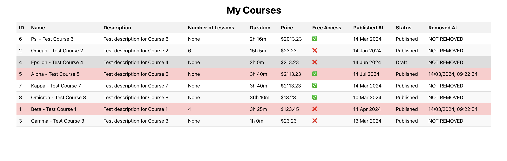

# Courses Management System

This is a React-based web application for managing courses. It allows users to view a list of courses along with their details such as name, description, duration, price, availability, and more.




## Features

- Display a list of courses with their details.
- Format the duration and published date for better readability.
- Highlight courses based on their status and removal.
- Responsive design for a seamless experience across different devices.

## Technologies Used

- React
- JavaScript
- CSS

## Getting Started

1. Clone the repository:

   ```bash
   git clone git@github.com:emon535/cpd-clients.git


## Backend Response Structure

The backend provides a JSON response with the following structure:

```json
{
  "courses": [
    {
      "id": "Course ID",
      "uuid": "Course UUID",
      "name": "Course Name",
      "description": "Course Description",
      "freeAccess": "1 if Free Access, 0 if not",
      "duration": "Course Duration in seconds",
      "rating": "Course Rating",
      "price": "Course Price",
      "animalId": "ID of the Animal",
      "animalName": "Name of the Animal",
      "lessons": "Array of Lessons (if available)",
      "status": "Course Status (1 for Published, 0 for Draft)",
      "publishAt": "Date and Time of Course Publishing",
      "createdAt": "Date and Time of Course Creation",
      "removedAt": "Date and Time of Course Removal (if removed)"
    },
    // Other courses...
  ]
}
```
